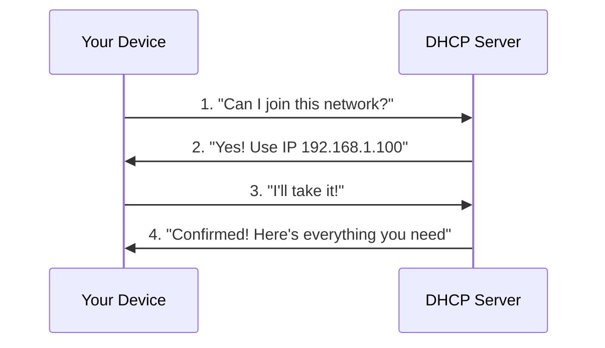

# Networking & Communication

## Network Models

Frameworks that organize how different parts of network communication work together, like organizing a company into departments with specific responsibilities.

**Network models** help us understand how data travels from your application (like a web browser) down through various layers to the physical network, and back up on the receiving end.

=== "TCP/IP Model"

    The practical model that the internet actually uses, with four main layers:

    **TCP/IP (Transmission Control Protocol/Internet Protocol)** is the framework that powers the internet and most modern networks.

    !!! info "The Four Layers"

        - **Application Layer**: Where your programs operate (web browsers, email clients)
        - **Transport Layer**: Ensures reliable data delivery between devices
        - **Internet Layer**: Routes data across networks using IP addresses
        - **Network Access Layer**: Handles the physical connection (WiFi, Ethernet cables)

=== "OSI Model"

    A theoretical seven-layer model used for teaching and understanding network concepts:

    **OSI (Open Systems Interconnection)** breaks network communication into more detailed layers for educational purposes.

    !!! info "The Seven Layers"

        - **Application (L7)**: User-facing programs and services
        - **Presentation (L6)**: Data formatting, encryption, compression
        - **Session (L5)**: Managing connections between applications
        - **Transport (L4)**: Reliable data delivery
        - **Network (L3)**: Routing and addressing
        - **Data Link (L2)**: Local network communication
        - **Physical (L1)**: Actual cables, signals, and hardware

!!! tip "What You'll Encounter"

    - **TCP/IP** is what actually runs the internet
    - **OSI** is helpful for understanding concepts and troubleshooting
    - Most network discussions use TCP/IP layer names

## Network Addressing & Identification

### IP Addressing

A unique number assigned to every device on a network, like a postal address that lets other devices know where to send data.

**IP (Internet Protocol) addresses** work like house addresses - they tell the network exactly where to deliver information. Every device needs one to communicate.

#### IPv4 and IPv6

The two main types of IP addresses used today:

**IPv4** is the older, widely-used format that looks like `192.168.1.1` - four numbers separated by dots.

**IPv6** is the newer format designed to provide more addresses, looking like `2001:db8::1` - eight groups of characters separated by colons.

!!! tip "What You'll See"

    - **IPv4**: `192.168.1.100`, `10.0.0.1`, `203.0.113.5`
    - **IPv6**: `2001:db8::1`, `::1` (shortened format)
    - **Most networks still use IPv4**, but IPv6 is becoming more common

#### Public vs Private Addresses

Your device actually has two types of IP addresses:

**Public IP addresses** are unique across the entire internet - like your home's street address that mail carriers use.

**Private IP addresses** are only used within your local network - like apartment numbers within a building.

!!! example "Common Private IP Ranges"

    - **Home networks**: Usually `192.168.1.x` (like 192.168.1.100)
    - **Office networks**: Often `10.x.x.x` or `172.16.x.x`
    - **These addresses are reused** - many homes use the same private ranges

#### Localhost

A special address that always points to your own device:

**127.0.0.1** (IPv4) and **::1** (IPv6) both mean "this computer" - used for testing applications locally before deploying them to the network.

### DNS (Domain Name System)

A service that converts human-friendly website names into IP addresses that computers can understand.

**DNS (Domain Name System)** is like a phone book for the internet - when you type "google.com", DNS looks up the actual IP address and connects you to the right server.

#### How DNS Works

When you visit a website, a quick lookup happens automatically:

1. **Check local cache**: Your computer first checks if it already knows the IP address
2. **Ask DNS server**: If not cached, it asks your internet provider's DNS server
3. **Find the answer**: The DNS server looks up the IP address
4. **Connect**: Your browser connects to the website using the IP address

!!! example "DNS in Action"

    - You type: `github.com`
    - DNS finds: `140.82.114.4`
    - Your browser connects to that IP address
    - GitHub's website loads

#### Common DNS Records

Different types of DNS records serve different purposes:

!!! info "Main Record Types"

    - **A Record**: Points a domain to an IPv4 address
    - **CNAME**: Creates an alias (like www.example.com → example.com)
    - **MX**: Specifies mail servers for email delivery

### Port Numbers

Numbers that specify which service or application to connect to on a device, like apartment numbers in a building.

**Port numbers** work with IP addresses to create complete network addresses. If an IP address is like a building address, then ports are like apartment numbers that specify exactly which service you want to reach.

!!! example "How Ports Work"

    - **192.168.1.10:80** → Connect to the web server on device 192.168.1.10
    - **192.168.1.10:22** → Connect to SSH on the same device
    - **Same device, different services** - ports let one computer run multiple network services

!!! tip "Common Port Numbers"

    - **Port 80**: Web servers (HTTP)
    - **Port 443**: Secure web servers (HTTPS)
    - **Port 22**: SSH remote access
    - **Port 25**: Email servers (SMTP)
    - **Port 53**: DNS servers

### Socket

A communication channel that combines an IP address and port number to establish a network connection between two applications.

**Sockets** are like phone calls between applications - they create a direct communication channel using a specific IP address and port combination (like `192.168.1.5:80`).

!!! tip "Socket in Practice"

    When your browser connects to a website:

    - **Browser creates a socket** using your IP + random port (like `192.168.1.100:54321`)
    - **Connects to web server socket** at the website's IP + port 80 (like `93.184.216.34:80`)
    - **Data flows through this socket connection** until the page loads

### Data Packet

A unit of data that is transferred over a network. Data sent over network is divided into packets, they are then reassembed by the device that received them.

#### Headers and encapsulation

**Encapsulation** is the process of wrapping data chunks in layers of **headers** as it moves down the protocol stack.

**Headers** are the information (protocol, source address, destination address,etc) added to the packet.

!!! note annotate

    If the orginal data is too large to  fit into a single packet, the data will be divided into multiple smaller chuncks. (1) Each of these chuncks will then go through the encapsulation process to become a data packet.

    !!! info "How does it work?"

        When you send information across a network:

        1. The original data (like text from a webpage) starts as raw content.
        2. The transport layer (TCP) divides large data into appropriate segments if needed
        3. As this data moves down through the network protocol stack, each layer adds its own header information (encapsulation):
           - The application layer might format it as HTTP
           - The transport layer (TCP/UDP) adds port information and sequence numbers
           - The network layer (IP) adds source and destination IP addresses
           - The link layer adds MAC addresses
        4. After complete encapsulation, if the packet exceeds the network's MTU, IP fragmentation occurs.

1. This division typically happens at different layers: At the **transport layer** (TCP), large data is segmented into smaller pieces that fit within the Maximum Segment Size (MSS). After encapsulation, if packets are still too large, the **network layer** (IP) will perform further fragmentation.

#### MTU and Fragmentation

**MTU**: The largest packet size that can be sent over a network connection.

**Fragmentation**: When a packet is larger than the MTU, it gets split into smaller fragments:

- Each fragment gets its own set of headers
- Fragments are reassembled at the destination
- The IP header contains information to help with reassembly

!!! tip "Standard MTU Sizes"

    - Ethernet: 1500 bytes
    - Wi-Fi: 1500 bytes

!!! info "Relationship between Encapsulation and Fragmentation"

    1. **MTU Constraints**: Each network link has an MTU limit. If after encapsulation a packet exceeds this limit, fragmentation becomes necessary.

    2. **Header Overhead**: Each layer's headers (added during encapsulation) reduce the amount of space available for actual data. For example, if MTU is 1500 bytes and headers take 40 bytes, only 1460 bytes remain for data (the MSS).

    3. **Performance Impact**: Fragmentation impacts network performance because:

          - It increases overall overhead (each fragment needs its own complete headers)
          - All fragments must arrive for reassembly (if one is lost, everything must be retransmitted)
          - Reassembly requires extra processing and memory

    4. **Path MTU Discovery**: Modern networks use this technique to determine the smallest MTU along the entire path and limit packet sizes accordingly to avoid fragmentation.

## Transport Protocols

**Transport protocols** enable communication between applications across networks, handling data delivery between endpoints. They manage how data is packaged, transmitted, received, and verified.

TCP and UDP represent two fundamentally different approaches to network communication:

- TCP: Prioritizes reliability and order at the cost of speed and overhead

- UDP: Prioritizes speed and simplicity at the cost of reliability guarantees

### TCP

A reliable method for sending data that ensures every piece arrives correctly and in the right order, like sending a registered package that requires signatures at each step.

**TCP (Transmission Control Protocol)** is like having a conversation where you confirm each sentence before continuing - it's slower but guarantees nothing gets lost or mixed up.

#### Connection-Oriented Communication

TCP establishes a dedicated connection through _Three-way Handshake_ before exchanging data and ensures all packets arrive correctly.

!!! info "Three-Way Handshake"

    A fundamental process to establish a reliable connection between a client and a server before data transmission begins. It's like a formal greeting ritual that happens in three steps:

    ```mermaid
    sequenceDiagram
        participant Client
        participant Server

        Note over Client,Server: Connection Establishment
        Client->>Server: SYN (seq=x)
        Note right of Client: Client sends SYN packet with initial sequence number
        Server->>Client: SYN-ACK (seq=y, ack=x+1)
        Note left of Server: Server acknowledges client's SYN and sends its own SYN
        Client->>Server: ACK (seq=x+1, ack=y+1)
        Note right of Client: Client acknowledges server's SYN
        Note over Client,Server: Connection Established

    ```

    1. **SYN**: The client initiates the connection by sending an SYN packet with client's sequence number (x)
    2. **SYNC-ACK**: The server responds with a SYN-ACK message to acknowledge the client's request and synchronize sequence numbers (server's sequence number (y) and client's sequence number + 1 (x+1))
    3. **ACK**: The client sends an ACK packet with server's sequence number + 1 (y+1) to establish the connection.

!!! question "Why Do We Need Three-Way Handshake?"

    The three-way handshake is necessary because both parties need to confirm that they can send and receive messages properly.

    <figure markdown>
        { width="650" }
        <figcaption>TCP Three-way Handshake Process</figcaption>
    </figure>

#### TCP Socket States

TCP connections go through different states throughout their lifecycle.

| State        | Description                                                                                     |
| ------------ | ----------------------------------------------------------------------------------------------- |
| CLOSED       | The default state when no connection exists                                                     |
| LISTEN       | The server is waiting for connection requests (only servers enter this state)                   |
| SYN_SENT     | The client has sent a SYN packet and is waiting for a response                                  |
| SYN_RECEIVED | The server has received a SYN and sent a SYN-ACK, waiting for the final ACK                     |
| ESTABLISHED  | The three-way handshake is complete and data transfer can begin                                 |
| FIN_WAIT_1   | The application has finished sending data and sent a FIN packet to start closing the connection |
| FIN_WAIT_2   | The local end has received acknowledgment of its FIN packet                                     |
| CLOSE_WAIT   | The remote end has initiated connection termination, and the local end needs to close too       |
| LAST_ACK     | The local end has sent its own FIN after receiving a FIN from the remote end                    |
| TIME_WAIT    | Waiting to ensure the remote end received the acknowledgment of its FIN                         |
| CLOSING      | Both sides initiated closing simultaneously                                                     |

!!! note "Key Characteristics"

    - Reliability: Acknowledgment and retransmission of lost packets
    - Ordered Delivery: Sequence numbers ensure correct ordering
    - Flow Control: Prevents overwhelming receiver with too much data
    - Congestion Control: Adjusts transmission rate based on network conditions
    - Error Detection: Checksum verification ensures data integrity

!!! example "Common TCP Use Cases"

    - Web browsing (HTTP/HTTPS)
    - Email (SMTP, IMAP, POP3)
    - File transfers (FTP, SFTP)
    - Remote terminal access (SSH)
    - Database connections

### UDP

A fast method for sending data that prioritizes speed over reliability, like shouting across a crowded room - quick but some messages might not get through.

**UDP (User Datagram Protocol)** is like sending postcards - fast and simple, but no guarantee they'll arrive or arrive in order.

#### Connectionless Communication

UDP sends datagrams without establishing a dedicated connection, prioritizing speed over reliability.

!!! info "UDP Communication Flow"

    In contrast to TCP's connection-oriented approach, UDP operates without formal connection between endpoints:

    ```mermaid
    sequenceDiagram
        participant Client
        participant Server

        Note over Client,Server: Connectionless Communication
        Client->>Server: Datagram 1
        Client->>Server: Datagram 2
        Client->>Server: Datagram 3
        Note right of Client: Datagrams sent without waiting for acknowledgment
        Note left of Server: May arrive in any order, or not at all

    ```

    1. **No Handshake**: Packets are sent immediately without connection establishment
    2. **Stateless Communication**: No connection state is maintained between endpoints
    3. **Independent Packets**: Each datagram handled independently ("fire and forget")
    4. **No Order Guarantee**: Packets may arrive in a different order than sent, with no mechanism to restore sequence

#### UDP Socket States

UDP sockets have a simplified state model compared to TCP:

`Simple Lifecycle: Create → Bind → Send/Receive → Close`

| State     | Description                                                                   |
| --------- | ----------------------------------------------------------------------------- |
| UNBOUND   | Socket created but not yet assigned to an address or port                     |
| BOUND     | Socket assigned to a local address and port, ready for communication          |
| CONNECTED | Socket filtered to receive only from a specific address (not true connection) |
| CLOSED    | Socket is no longer valid and cannot be used for communication                |

!!! note "Key Characteristics"

    - Message-Oriented: Preserves message boundaries
    - Unreliable: No guaranteed delivery or acknowledgments
    - Unordered: No sequence numbers or packet ordering
    - Lightweight: Minimal header overhead (8 bytes)
    - Broadcast/Multicast: Supports one-to-many communication patterns
    - No Flow Control: Can send at any rate regardless of receiver capacity

!!! example "Common UDP Use Cases"

    - Domain Name System (DNS)
    - Streaming media (audio/video)
    - Voice over IP (VoIP)
    - Online gaming
    - IoT sensor data
    - Network monitoring (SNMP)

### TCP vs UDP

Choose the right protocol based on what matters most for your application:

| What You Need   | Use TCP                              | Use UDP                                       |
| --------------- | ------------------------------------ | --------------------------------------------- |
| **Reliability** | Web browsing, file downloads, email  | Video streaming, online gaming, live chat     |
| **Speed**       | When data must be perfect            | When speed matters more than perfect delivery |
| **Examples**    | Loading a webpage, downloading files | Video calls, DNS lookups, live streams        |

!!! tip "Quick Decision Guide"

    - **Need every byte to arrive perfectly?** → Use TCP
    - **Need it fast, occasional missing data OK?** → Use UDP
    - **Most web applications** → TCP
    - **Real-time applications** → UDP

## Network Services & Infrastructure

### DHCP

A service that automatically gives each device on a network a unique address and tells it how to communicate with other devices and access the internet.

**DHCP (Dynamic Host Configuration Protocol)** is like a hotel front desk that automatically assigns each device an IP address and provides all the network information needed to get online.

#### What Problem Does DHCP Solve?

Without DHCP, every time you connect a device to a network, you'd need to:

- Manually assign it a unique IP address
- Configure the subnet mask, gateway, and DNS servers
- Make sure no other device is using the same IP address
- Call IT support for every new device

DHCP eliminates this complexity by automatically providing everything your device needs to communicate on the network.

#### How DHCP Works

When you connect to WiFi, a quick 4-step conversation happens automatically:



1. **DISCOVER**: Your device asks for network access
2. **OFFER**: DHCP server offers an available IP address
3. **REQUEST**: Your device accepts the offered IP
4. **ACKNOWLEDGE**: Server confirms and provides full network configuration

#### IP Address Leases

Your IP address is "rented" rather than owned permanently (usually for 24 hours). This prevents unused addresses from being wasted - when you leave with your laptop, that IP becomes available for other devices.

!!! tip "What You'll Notice"

    - **Most of the time**: Nothing - it just works
    - **Occasionally**: Brief connection drops when your device renews its IP lease
    - **When traveling**: Seamlessly connect to different networks without reconfiguration

### NAT (Network Address Translation)

A system that allows multiple devices in your home or office to share a single public internet connection, like having multiple apartments share one main building address.

**NAT (Network Address Translation)** is what makes it possible for all your devices - phone, laptop, smart TV - to access the internet through your router's single public IP address.

#### How NAT Works

Your router acts as a translator between your private devices and the internet:

!!! example "NAT in Action"

    **When your laptop requests a website:**

    1. **Laptop sends**: "I'm 192.168.1.100, get me google.com"
    2. **Router translates**: "I'm 203.0.113.5 (public IP), get me google.com"
    3. **Website responds**: "Here's the page for 203.0.113.5"
    4. **Router translates back**: "Here's the page for your laptop at 192.168.1.100"

    Your router keeps track of which device requested what, so responses go to the right place.

!!! note "NAT Types"

    - **Source NAT (SNAT)**: Modifies source address in outgoing packets (most common)
    - **Destination NAT (DNAT)**: Modifies destination address in incoming packets (for port forwarding)
    - **Port Address Translation (PAT)**: Uses different ports to distinguish connections (also called NAPT)

#### NAT types and challenges

Different NAT implementations vary in restrictiveness, affecting connectivity for certain applications.

!!! note "NAT Classifications"

    - **Full-cone NAT**: Most permissive - any external host can send to an internal client once a connection is established
    - **Address-restricted cone**: Only allows incoming traffic from IPs that the internal host has previously sent traffic to
    - **Port-restricted cone**: Only allows incoming traffic from specific IP:port combinations that the internal host has communicated with
    - **Symmetric NAT**: Most restrictive - uses different external ports for each destination, challenging for peer-to-peer applications

!!! warning "NAT Traversal Challenges"

    - **Peer-to-peer (P2P) connections**: Difficult when both peers are behind NAT
    - **Server-client model disruption**: External hosts can't initiate connections to NAT-hidden services
    - **Protocol incompatibility**: Some protocols embed IP addresses in payload (e.g., FTP, SIP)
    - **IPv6 transition**: NAT was a short-term solution for IPv4 exhaustion

!!! tip "NAT Traversal Techniques"

    - **STUN (Session Traversal Utilities for NAT)**: Helps discover NAT type and external IP/port
    - **TURN (Traversal Using Relays around NAT)**: Uses relay server for restrictive NATs
    - **ICE (Interactive Connectivity Establishment)**: Framework combining STUN, TURN, and direct connectivity
    - **UPnP/NAT-PMP**: Protocols allowing applications to configure port forwarding automatically

### Routing

The process of selecting paths in a network along which to send network traffic.

!!! info "Routing Process"

    When a router receives a packet:

    1. Extract the destination IP address
    2. Look for the longest matching prefix in the routing table
    3. Forward the packet to the next hop or directly to the destination
    4. If no match is found, send to the default gateway (if configured)

!!! info "Learn More"
For a detailed explanation of how routing works across the entire internet, including the postal system analogy, autonomous systems, and routing protocols, see [How Internet Routing Works](routing-deep-dive.md).

#### Default gateways

A **default gateway** is the node (typically a router) that serves as an access point to other networks when no specific route matches the destination.

!!! note

    - Default route is represented as 0.0.0.0/0 in routing tables
    - It's used as a "last resort" when no more specific route exists
    - In home/office networks, the default gateway connects the local network to the internet
    - Without a default gateway, devices can only communicate within their local network

!!! example

    For a device with IP 192.168.1.100 and subnet mask 255.255.255.0:

    - Can directly reach addresses 192.168.1.1 through 192.168.1.254
    - Must use default gateway (typically 192.168.1.1) to reach any other address

#### Autonomous Systems

Large networks (like your ISP, Google, or Amazon) that operate independently and connect to each other to form the internet.

**Autonomous Systems (AS)** are essentially internet "neighborhoods" - each major organization runs their own network that connects to other networks. This is why the internet is called a "network of networks."

!!! tip "What Software Engineers Need to Know"

    - **Your ISP** (Comcast, Verizon) is one autonomous system
    - **Cloud providers** (AWS, Google Cloud, Azure) are separate autonomous systems
    - **When your app connects** to a cloud service, traffic often crosses multiple AS boundaries
    - **This affects latency** - traffic between different AS networks can be slower than within the same AS

### Proxies & Intermediaries

Servers that act as intermediaries between clients and other servers, either to help clients access the internet or to help servers handle client requests.

#### Forward Proxies

A server that sits between client devices and the internet, forwarding client requests to web servers.

**Forward proxies** act like intermediaries for clients - you configure your device to send requests through them, and they forward those requests to the internet on your behalf.

!!! tip "Common Forward Proxy Uses"

    - **Corporate internet filtering**: Block access to certain websites
    - **Content caching**: Speed up repeated requests
    - **Anonymity**: Hide your real IP address from websites
    - **Geo-bypassing**: Access content blocked in your region

##### VPNs and Proxies

**VPNs can function like forward proxies** but they're more comprehensive:

| Aspect              | Forward Proxy                 | VPN                          |
| ------------------- | ----------------------------- | ---------------------------- |
| **Traffic scope**   | Usually just web traffic      | All network traffic          |
| **Encryption**      | Usually none                  | Strong encryption            |
| **Configuration**   | Per-application               | System-wide                  |
| **Primary purpose** | Caching, filtering, anonymity | Privacy, security, tunneling |

!!! note "VPN vs Proxy"

    - **Commercial VPNs** (NordVPN, ExpressVPN) do act like forward proxies - they sit between you and the internet, hide your IP, and you configure your device to use them
    - **But VPNs do more**: They encrypt ALL your traffic and create secure tunnels, not just forward web requests

#### Reverse Proxies

A server that sits in front of web servers and forwards client requests to appropriate backend servers.

**Reverse proxies** act like intermediaries for servers - clients think they're talking directly to the web server, but they're actually talking to the proxy which then forwards requests to the real servers.

!!! tip "Common Reverse Proxy Uses"

    - **Load balancing**: Distribute requests across multiple servers
    - **SSL termination**: Handle encryption/decryption for backend servers
    - **Caching**: Store frequently requested content closer to users
    - **Security**: Hide backend server details from clients

#### Load balancers

A **load balancer** distributes incoming network traffic across multiple servers to ensure high availability and reliability.

!!! info "Load Balancing Methods"

    - **Round Robin**: Requests distributed sequentially to each server
    - **Least Connections**: Requests sent to server with fewest active connections
    - **Least Response Time**: Requests sent to server with fastest response time
    - **IP Hash**: Client IP determines which server receives the request (session persistence)
    - **Weighted**: Servers assigned different weights based on capacity

!!! example "Load Balancer Types"

    - **Layer 4 (Transport)**: Decisions based on IP address and port
    - **Layer 7 (Application)**: Content-aware, can route based on URL, HTTP headers, cookies
    - **Hardware**: Purpose-built appliances (e.g., F5, Citrix)
    - **Software**: Applications running on standard servers (e.g., NGINX, HAProxy)
    - **Cloud-based**: Managed services (e.g., AWS ELB, Google Cloud Load Balancing)

#### Forward vs Reverse Proxies: The Key Difference

The fundamental difference is **who they serve and where they sit**:

!!! example "Forward Proxy vs Reverse Proxy"

    **Forward Proxy** = Your personal assistant who makes calls for you

    - **Serves clients** (like your browser)
    - **You know it exists** - you configure your browser to use it
    - **Example**: You → Corporate Proxy → Internet

    **Reverse Proxy** = A company's receptionist

    - **Serves servers** (like web applications)
    - **You don't know it exists** - it appears to be the actual website
    - **Example**: You → CDN/Load Balancer → Web Servers

### Firewalls & Network Security

Network security devices that monitor and filter incoming and outgoing network traffic based on security rules.

#### Traffic filtering

Firewalls filter traffic based on predefined security rules to protect networks from unauthorized access and threats.

!!! info "Firewall Filtering Criteria"

    - Source and destination IP addresses
    - Port numbers
    - Protocol types (TCP, UDP, ICMP)
    - Application-specific data (for advanced firewalls)
    - Time of day
    - User identity (in next-gen firewalls)

!!! example "Firewall Types"

    - **Packet Filtering Firewalls**: Basic firewalls examining packet headers
    - **Circuit-Level Gateways**: Monitor TCP handshakes and sessions
    - **Application-Level Gateways (Proxies)**: Inspect application-layer data
    - **Stateful Inspection Firewalls**: Track the state of active connections
    - **Next-Generation Firewalls (NGFW)**: Combine traditional firewall with additional functionality (IPS, deep packet inspection)

#### Stateful vs stateless inspection

The primary distinction between stateful and stateless firewalls is whether they track the state of active network connections.

!!! note "Stateless Inspection"

    - Examines each packet in isolation
    - Uses static rules based on source/destination addresses and ports
    - Doesn't keep track of connection state
    - Faster but less secure
    - Vulnerable to IP spoofing and certain attacks

!!! note "Stateful Inspection"

    - Tracks the state of active connections in a state table
    - Understands the context of traffic based on previous packets
    - Can determine if a packet is part of an existing connection
    - More secure but requires more resources
    - Can prevent many types of attacks by validating connection sequences

!!! example "Stateful Firewall Operation"

    1. Outbound request creates an entry in the state table
    2. Inbound responses are checked against this table
    3. Packets that match known connections are allowed
    4. Packets claiming to be responses but without matching entries are blocked

## Performance Metrics

Key measurements that help evaluate network performance and identify issues.

### Latency

The time delay between a request being sent and the response being received, often measured in milliseconds.

!!! note "Latency Components"

    - **Propagation delay**: Time for signal to travel from source to destination (limited by speed of light)
    - **Transmission delay**: Time to push all the packet's bits onto the link
    - **Processing delay**: Time spent handling the packet inside devices
    - **Queuing delay**: Time spent waiting in buffers for processing

!!! example "Typical Values"

    - **Low latency**: < 100ms
    - **Medium latency**: 100-300ms
    - **High latency**: > 300ms

!!! warning "Impact on Applications"

    - **Web browsing**: Pages load slower with high latency
    - **Real-time audio/video**: Noticeable delays in conversation
    - **Online gaming**: Character/gameplay lag
    - **Financial trading**: Missed opportunities with millisecond delays

### Throughput

The amount of data that can be transferred from one point to another in a given time period.

!!! info "Throughput vs. Bandwidth"

    - **Bandwidth** is the theoretical capacity of the connection
    - **Throughput** is the actual amount of data transferred
    - Throughput is almost always lower than bandwidth due to protocol overhead, latency, network congestion, etc.

!!! info "Common Units"

    - Kbps (Kilobits per second)
    - Mbps (Megabits per second)
    - Gbps (Gigabits per second)

!!! tip "Factors Affecting Throughput"

    - Network congestion
    - Protocol overhead
    - Device limitations
    - Application design
    - Distance and physical media
    - TCP window size

### Bandwidth

The maximum data transfer rate of a network or internet connection.

!!! info "Typical Values"

    - **Home broadband**: 25-1000 Mbps
    - **Business connections**: 100 Mbps to 10+ Gbps
    - **Data center connections**: Multiple 10/40/100 Gbps links

!!! example "Bandwidth Requirements"

    | Application | Typical Minimum Bandwidth |
    |-------------|---------------------------|
    | Web browsing | 1-5 Mbps |
    | SD video streaming | 3-5 Mbps |
    | HD video streaming | 5-10 Mbps |
    | 4K video streaming | 25-50 Mbps |
    | Video conferencing | 1-6 Mbps |
    | Online gaming | 3-25 Mbps |
    | File downloads | Varies with urgency |

### Packet Loss

Percentage of packets that fail to reach their destination.

!!! info "Causes of Packet Loss"

    - Network congestion
    - Hardware failures
    - Software bugs
    - Signal interference (wireless)
    - Oversaturated network devices
    - Security issues (firewall drops)

!!! warning "Impact"

    - **<1%**: Generally acceptable
    - **1-2.5%**: Noticeable impact on real-time applications
    - **>3%**: Significant degradation in service quality

!!! tip "Detecting Packet Loss"

    ```bash
    $ ping -c 100 example.com | grep -o -P '\d+(?=% packet loss)'
    0
    ```

    A value of 0 indicates no packet loss during the test.

### Jitter

Variation in the delay of received packets.

!!! info "Why Jitter Matters"

    - Creates uneven delivery of real-time data
    - Causes stuttering in voice/video
    - Affects timing-sensitive applications
    - Less important for web browsing, file transfers

!!! info "Acceptable Values"

    - **<30ms**: Good for VoIP and video calling
    - **>30ms**: May cause quality issues in real-time communications

!!! tip "Reducing Jitter Impact"

    - Jitter buffers in real-time applications
    - Quality of Service (QoS) configurations
    - Consistent network paths
    - Adequate bandwidth provision

## Network Troubleshooting

### Common diagnostic tools

Network diagnostic tools help identify and resolve connectivity, performance, and configuration issues.

!!! info "Essential Diagnostic Tools"

    - **ping**: Tests basic connectivity and measures round-trip time
    - **traceroute/tracert**: Displays the path packets take to a destination
    - **nslookup/dig**: Queries DNS servers to resolve domain names
    - **ipconfig/ifconfig**: Displays network interface configurations
    - **netstat/ss**: Shows active network connections and listening ports
    - **tcpdump/Wireshark**: Captures and analyzes network packets
    - **nmap**: Network scanning and security auditing
    - **curl/wget**: Tests HTTP/HTTPS connections and downloads
    - **iperf**: Measures network performance (bandwidth, packet loss)
    - **mtr**: Combines ping and traceroute for continuous monitoring

!!! example "Using Diagnostic Tools"

    === "Ping Example"

        ```bash
        $ ping example.com
        PING example.com (93.184.216.34): 56 data bytes
        64 bytes from 93.184.216.34: icmp_seq=0 ttl=56 time=11.632 ms
        64 bytes from 93.184.216.34: icmp_seq=1 ttl=56 time=11.726 ms
        64 bytes from 93.184.216.34: icmp_seq=2 ttl=56 time=10.683 ms
        ```

        Indicates: Successful connectivity with ~11ms latency

    === "Traceroute Example"

        ```bash
        $ traceroute example.com
        traceroute to example.com (93.184.216.34), 64 hops max
        1  router.local (192.168.1.1)  1.170 ms  0.882 ms  0.798 ms
        2  isp-gateway.net (203.0.113.1)  12.616 ms  14.714 ms  15.494 ms
        3  isp-core-1.net (198.51.100.5)  15.746 ms  17.586 ms  16.003 ms
        4  internet-backbone.net (198.51.100.25)  20.853 ms  17.538 ms  18.012 ms
        5  example-edge.net (93.184.216.1)  19.125 ms  18.741 ms  18.294 ms
        6  example.com (93.184.216.34)  22.333 ms  21.496 ms  21.146 ms
        ```

        Indicates: The route takes 6 hops with potential bottleneck at hop 4

### Typical network issues

Common network problems encountered in software development and system administration.

!!! warning "Common Network Issues"

    - **Connectivity failures**: Complete inability to reach a service or resource
    - **High latency**: Excessive delays in data transmission
    - **Packet loss**: Data packets never reaching their destination
    - **DNS resolution problems**: Inability to convert domain names to IP addresses
    - **Routing issues**: Inefficient or incorrect paths through the network
    - **Firewall blockages**: Security configurations preventing legitimate traffic
    - **MTU mismatches**: Packet fragmentation or black-holing
    - **Bandwidth saturation**: Network congestion causing slowdowns
    - **Authentication failures**: Issues with access credentials
    - **Certificate errors**: Problems with TLS/SSL certificates or validation

!!! example "Symptom-Cause Correlation"

    | Symptom | Potential Causes | Initial Investigation |
    |---------|------------------|----------------------|
    | Can't reach website | DNS error, connectivity issue, server down | ping IP address, check DNS resolution |
    | Intermittent connection | Packet loss, routing issues, interference | ping with flood option, check for pattern |
    | Slow performance | Latency, bandwidth limitations, server overload | Run traceroute, check bandwidth usage |
    | Connection timeouts | Firewall blocking, server not responding, misrouting | Check firewall logs, verify server status |

### Debugging approaches

Systematic methods for identifying, isolating, and resolving network problems.

!!! tip "Network Troubleshooting Methodology"

    1. **Identify the problem**: Clearly define the issue and its symptoms
    2. **Gather information**: Collect relevant data about the network environment
    3. **Analyze the OSI layers systematically**: Start from physical layer and move up
    4. **Isolate the issue**: Determine which component or segment is causing the problem
    5. **Implement a solution**: Make necessary changes to resolve the issue
    6. **Verify the fix**: Confirm the problem is resolved
    7. **Document the solution**: Record the issue and resolution for future reference

!!! note "OSI Layer Troubleshooting Approach"

    === "Physical & Data Link (L1-L2)"

        - Check cables, connections, interface status
        - Verify link lights, interface errors, duplex mismatches
        - Commands: `ifconfig`/`ipconfig`, `ethtool`, check hardware

    === "Network & Transport (L3-L4)"

        - Verify IP configuration, routing, and connectivity
        - Test basic connectivity and trace packet path
        - Commands: `ping`, `traceroute`, `route`, `netstat`/`ss`

    === "Session & Above (L5-L7)"

        - Check application configuration, ports, and services
        - Test specific services and application functionality
        - Commands: `telnet`, `nslookup`/`dig`, `curl`, application logs

!!! example "Divide and Conquer Approach"

    For a web application connectivity issue:

    1. Can the client reach anything on the internet? (Test with `ping 8.8.8.8`)
    2. Can the client resolve DNS? (Test with `nslookup example.com`)
    3. Can the client reach the web server? (Test with `ping web-server-ip`)
    4. Is the web server listening on the expected port? (Test with `telnet web-server-ip 80`)
    5. Is there an application-specific error? (Check HTTP status codes, application logs)

!!! tip "Advanced Debugging Techniques"

    - **Packet Capture Analysis**: Use Wireshark/tcpdump to inspect actual packets
    - **Network Baselining**: Compare current performance to established baselines
    - **Configuration Comparison**: Compare working vs. non-working configurations
    - **Control Environment Testing**: Test in a simplified environment to rule out variables
    - **Log Correlation**: Analyze logs from multiple devices to identify patterns
